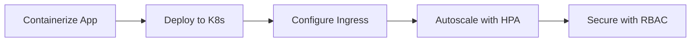

# 🚀 Kubernetes Learning Lab

"Mastering the orchestration of the future, one pod at a time."

## 🌟 About This Project

A hands-on journey through Kubernetes deployment patterns, featuring:

- **Production-grade** Streamlit AI chatbot deployment  
- **Real-world** configurations (HPA, Ingress, Secrets)  
- **DevOps meets AI** - Bridging ML models and cloud-native infra  

```bash
kubectl get pods -n armghan-innovations
```

## 🛠️ Tech Stack

| Component       | Tech Used                     | Purpose                          |
|----------------|-------------------------------|----------------------------------|
| **Orchestration** | Kubernetes (+ OpenShift)      | Container management             |
| **App Framework** | Streamlit                     | AI chatbot interface             |
| **AI Backend**   | Groq LPU + LangChain          | High-speed LLM inference         |
| **Monitoring**   | Prometheus + Grafana          | Performance tracking             |

## 🧪 Lab Experiments



## 🚦 Quick Start

1. **Deploy the AI Bot**:

   ```bash
   kubectl apply -f deployment.yaml
   kubectl apply -f service.yaml
   ```

2. **Access the Chatbot**:

   ```bash
   kubectl port-forward svc/genai-bot-service 8501:8501
   ```

   Open: [http://localhost:8501](http://localhost:8501)

3. **Trigger Autoscaling**:

   ```bash
   kubectl run -i --tty load-generator --image=busybox -- sh -c "while true; do wget -qO- http://genai-bot-service:8501; done"
   ```

## 📊 Architecture

  *Production-ready deployment featuring:*

- Multi-stage Docker builds  
- Non-root security context  
- Liveness/Readiness probes  
- Resource quotas  

## 🧠 Key Learnings

✅ **Core Concepts**: Pods, Deployments, Services, Ingress  
✅ **Scaling**: Horizontal Pod Autoscaler (HPA)  
✅ **Security**: Secrets, RBAC, Network Policies  
✅ **CI/CD**: GitOps with ArgoCD  

## 🔮 Future Roadmap

- [ ] Add Istio service mesh  
- [ ] Implement GPU node autoscaling  
- [ ] Build custom Kubernetes operator  

## 🤝 Connect

```python
print("Let's collaborate on cloud-native AI systems!")
```

[](https://www.linkedin.com/in/syed-armghan-ahmad/)  
[](https://github.com/SyedArmghanAhmad)  

---
> "Kubernetes is the Linux of the cloud" — *Kelsey Hightower*
